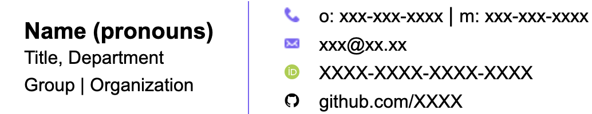
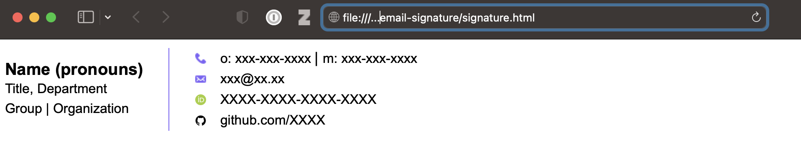
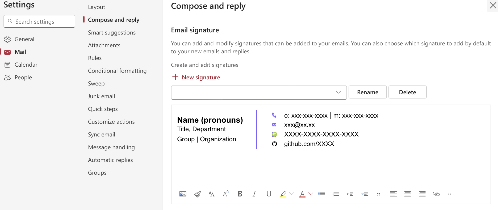

# README

This repository contains an email signature written in HTML. The HTML output from the
[free signature generator][signature-generator] by HubSpot was used as a starting point.



## Usage

1. Clone the repository

    ```shell
    git clone git@github.com:ugognw/email-signature.git
    ```

2. Open `signature.html` in any browser (shown for Safari below).

    

3. Copy the content and paste into the signature creation UI (shown for MS Outlook below)

    

[signature-generator]: https://www.hubspot.com/email-signature-generator?__hstc=203080910.8665ca620640b5453853fc08d220590c.1728765994680.1728765994680.1728765994680.1&__hssc=203080910.1.1728765994680&__hsfp=3325450404
